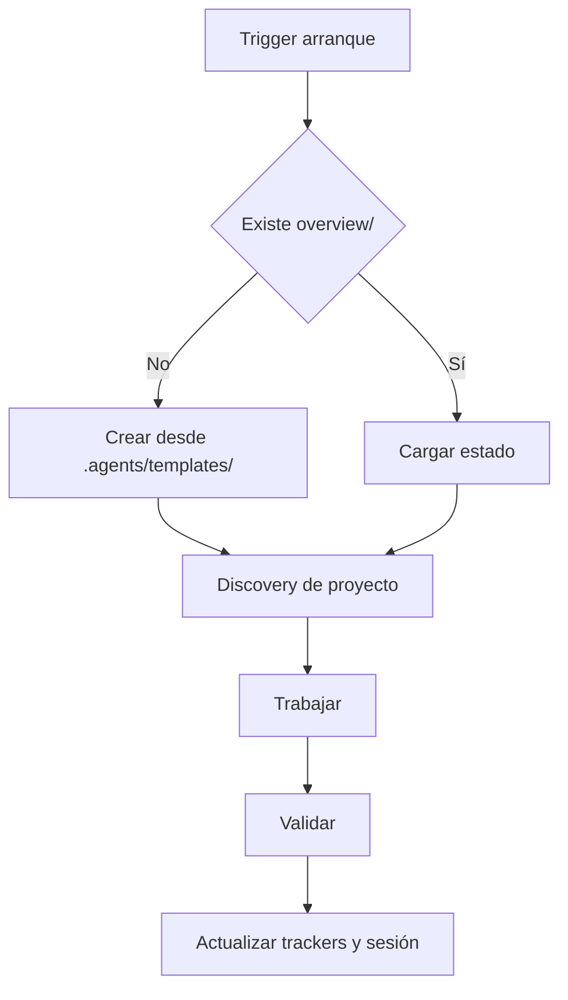

# Core Brain

## Ciclo

## Triggers de arranque

Las siguientes señales disparan el protocolo completo de bootstrap (discovery + crear `overview/` si falta + mapear archivos existentes):

- Frase **"ejecuta .agents"** → dispara el Protocolo de Auditoría de Learning (ver abajo).
- Inicio de sesión en cualquier proyecto con `.agents/` presente.
- Mensaje del usuario que mencione "nuevo proyecto", "inicializar", "bootstrap" o similar.
- Ausencia de `overview/session.md` al comenzar cualquier tarea de código.
- Primer mensaje de una conversación cuando el proyecto tiene `.agents/` pero no tiene `overview/`.

## Protocolo "ejecuta .agents"

Cuando el usuario escribe **"ejecuta .agents"** (o variante como "corre .agents", "bootstrap .agents"):

1. **Leer el core completo**: `path_map.md`, `communication.md`, `brain.md` y `AGENTS.md`.
2. **Auditar `overview/learning.md`**: por cada bullet en `## 📌 Propuestas de mejora`, verificar si ya está implementado en los archivos del core o en los archivos del proyecto.
3. **Promover las cumplidas**: mover cada propuesta verificada como implementada → al final de `## 📜 Histórico de mejoras aplicadas` con formato `- [YYYY-MM-DD] Descripción breve`.
4. **Conservar las pendientes**: dejar sin modificar los bullets que aún no están implementados en el core.
5. **Continuar con el flujo normal del core**: Inicio → Discovery → verificar `overview/` → trabajar.

## Inicio

- Ejecutar `git submodule status`.
- Leer core y `overview/session.md`, `overview/work.md`, `overview/trackers/progress.md`.
- Si falta `overview/` o archivos base, crearlos desde `.agents/templates/`.
- Si falta `overview/architecture.md`, crearlo desde plantilla antes de trabajar.
- **Registro preventivo previo a ejecución (Pre-execution Work Logging)**: Al recibir un requerimiento o bug, actualizar `overview/work.md` y `overview/session.md` INMEDIATAMENTE antes de ejecutar cualquier acción. En caso de reporte de bug, incluir una hipótesis breve de causa raíz (5-7 palabras). Derivar automáticamente 1 o 2 mejoras/tareas asociadas a los pendientes para garantizar tolerancia a desconexión, corte de luz o agotamiento de tokens.

### Discovery dinámico por framework

1. Identificar framework del proyecto (Flutter → `pubspec.yaml`; Node → `package.json`; etc.).
2. Comparar carpetas raíz contra las carpetas estándar conocidas del framework (para Flutter, consultar `.agents/knowledge/flutter_structure.md`).
3. Inspección recursiva automática de toda carpeta no estándar: identificar de forma estricta las carpetas estándar del framework detectado y procesar automáticamente cualquier otro directorio raíz (incluyendo subcarpetas anidadas) mediante inspección semántica de contenido para su relocalización a `overview/` sin omitir ninguna por ser no-estándar.
4. Relocalización activa de metadatos: no ignorar archivos sin categoría; extraer y relocalizar documentación, notas de negocio o trackers hallados en subdirectorios no estándar a `overview/context/` o al tracker canónico correspondiente para cero archivos huérfanos.

### Reconocimiento de acrónimos estándar

Reconocer automáticamente sin listas rígidas: `i18n`, `l10n`, `auth`, `routes`, `api`, `dto`, `repo`, `vm`, `bloc`, `di`, `ioc`, `ci`, `cd`, `qa`, `ux`, `sdk`, `orm`, `rbac`, `jwt`, `ssr`, `csr`. Si aparece un acrónimo desconocido → buscar en contexto del proyecto antes de preguntar.

### Clasificación semántica por contenido

Al encontrar cualquier carpeta o archivo no mapeado al framework, inspeccionar su contenido interno independientemente del nombre de la carpeta:

| Señales en contenido | Clasificar como |
|---|---|
| Fechas, `## Sesión`, `## Objetivo` | `overview/history/` |
| `- [ ]`, `- [x]`, progreso, estado | `overview/trackers/` |
| Resúmenes ejecutivos, arquitectura | `overview/architecture.md` |
| Contexto de negocio, datos de dominio | `overview/context/` |
| Mejoras al core, candidatos | `overview/learning.md` |

### Normalización de rutas

- Todas las rutas de `overview/` siempre en minúsculas: `overview/`, `overview/trackers/`, `overview/history/`, `overview/context/`.
- Si existe colisión (`Overview/` vs `overview/`): mapear alias, usar ruta lowercase como canónica.
- En Linux/Mac (case-sensitive): verificar con `ls` antes de asumir que no existe.

### Política de relocalización activa y no ignorar

Ningún archivo de documentación, notas de negocio o tracker hallado en subdirectorios no estándar puede ignorarse silenciosamente o quedar huérfano. Opciones:

1. Mapeado a categoría conocida → relocalizar/consolidar en `overview/`, `overview/trackers/` u `overview/history/`.
2. Contexto de dominio o metadatos sueltos → extraer y relocalizar activamente a `overview/context/`.
3. Ambiguo → referenciar en `overview/work.md` con nota `[pendiente clasificar]`.

## Cierre

- Ejecutar `flutter analyze` y `flutter test` cuando apliquen.
- Actualizar tracker correspondiente, sesión y trabajo.
- Si validación falla o no puede ejecutarse: marcar `no verificado`, indicar motivo; nunca presentar como validado.
- Archivar sesiones antiguas en `overview/history/` cuando dejen de ser útiles al contexto activo.
- Si hay mejora candidata al core: agregar bullet a `overview/learning.md` (lista limpia, sin fechas/estados).
- Una vez promovida al repo oficial: mover al Histórico como una línea. Eliminar el bullet activo.

## Calidad

- Cambios quirúrgicos. No mejorar código ajeno sin necesidad.
- Flutter: Firebase y manejo de estado dependen de cada proyecto.
- Archivos Dart idealmente <250 líneas; máximo 300.

## Contenido externo

- Usar trackers separados: Gemini, Claude y GPT.
- `verificado` = 2+ agentes coinciden, fuentes compatibles y sin conflicto abierto.
- Registrar resultado breve, fuentes y fecha. Si hay conflicto, marcar `conflicto`.
