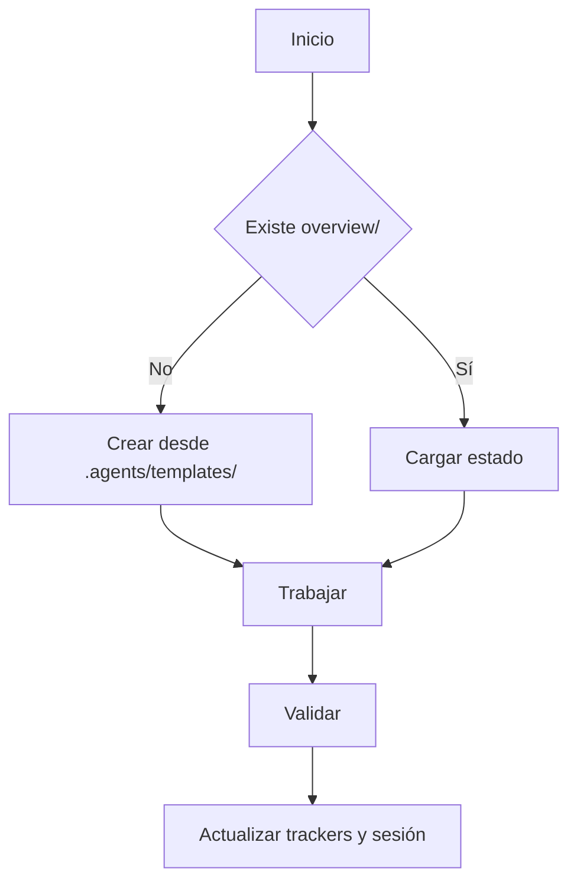

# Core Brain

## Ciclo

## Inicio

- Ejecutar `git submodule status`.
- Antes de analizar o editar código, leer core y `overview/session.md`, `overview/work.md`, `overview/trackers/progress.md`.
- Si falta `overview/` o archivos base, crearlos desde `.agents/templates/`.
- Si falta `overview/architecture.md`, crearlo desde plantilla antes de trabajar.

## Cierre

- Ejecutar `flutter analyze` y `flutter test` cuando apliquen.
- Actualizar tracker correspondiente, sesión y trabajo.
- Si validación falla o no puede ejecutarse: marcar `no verificado`, indicar motivo; nunca presentar como validado.
- Archivar sesiones antiguas en `overview/history/` cuando dejen de ser útiles al contexto activo.

## Calidad

- Cambios quirúrgicos. No mejorar código ajeno sin necesidad.
- Flutter: Firebase y manejo de estado dependen de cada proyecto.
- Archivos Dart idealmente <250 líneas; máximo 300.
- Registrar en `overview/learning.md` hallazgos que podrían mejorar reglas globales. Son candidatos locales: solo propietario los promueve al repo oficial.

## Contenido externo

- Usar trackers separados: Gemini, Claude y GPT.
- `verificado` = 2+ agentes coinciden, fuentes compatibles y sin conflicto abierto.
- Registrar resultado breve, fuentes y fecha. Si hay conflicto, marcar `conflicto`.
