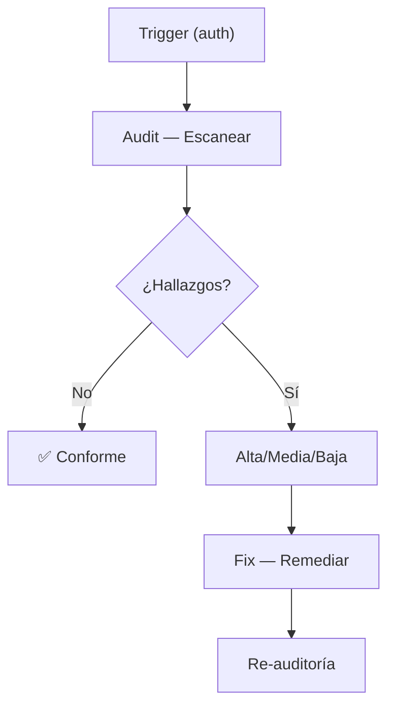

# Motor de Decisiones — Auth/OAuth2

## Flujo

## Matriz de Decisión

| Situación | Prioridad | Acción |
|---|---|---|
| Vulnerabilidad crítica del dominio | Alta | Fix inmediato |
| Violación de convención | Media | Corrección planificada |
| Mejora opcional | Baja | Sugerencia documentada |
