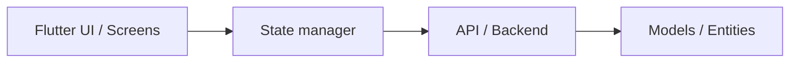

# Arquitectura Flutter — Referencia de Capas

> **Referencia de capas sugeridas** para describir la arquitectura de un proyecto Flutter.
> La plantilla real para crear `overview/architecture.md` está en `templates/architecture.md`.
> Cargar bajo demanda cuando se necesite orientación sobre organización de capas (Clean Arch, etc.).

Capas sugeridas:

1. Presentation: pantallas, widgets, controlador/proveedor elegido.
2. Domain: entidades, casos de uso, contratos de repositorio.
3. Data: implementaciones, Firebase/API/BD local según proyecto.
