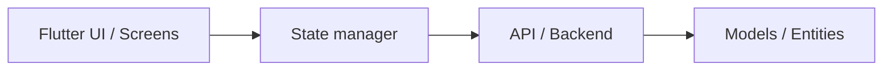

# Arquitectura Flutter

Plantilla para copiar a `overview/architecture.md` si proyecto necesita describir arquitectura real.

Capas sugeridas:

1. Presentation: pantallas, widgets, controlador/proveedor elegido.
2. Domain: entidades, casos de uso, contratos de repositorio.
3. Data: implementaciones, Firebase/API/BD local según proyecto.
