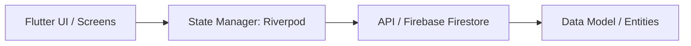

# ARQUITECTURA Y PATRONES DEL SISTEMA

> [!IMPORTANT]
> **Este archivo es una PLANTILLA.** Al iniciar un nuevo proyecto, copiar a `overview/architecture.md` y reemplazar el diagrama con la arquitectura real del proyecto. Cargar bajo demanda cuando se vaya a modificar o reestructurar módulos.

## FLUJO DE ARQUITECTURA DE LA APLICACIÓN

## CAPAS DEL SISTEMA
1. **Presentation:** Screens, Widgets, Riverpod Providers.
2. **Domain:** Entities, Use Cases / Interactors, Repository Contracts.
3. **Data:** Repository Implementations, Data Sources (Firestore / Local DB).
