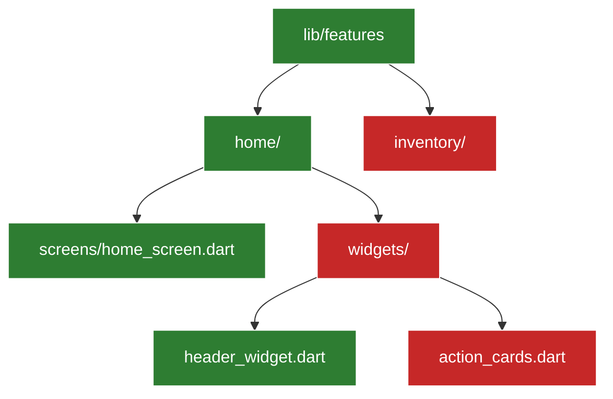

# RASTREADOR DE RUTAS, CARPETAS Y AVANCE DE AUDITORÍA

> [!IMPORTANT]
> **Este archivo es una PLANTILLA.** El agente debe crear una copia en `overview/tracker.md` en la raíz de cada proyecto Flutter. No modificar este archivo del submódulo `.agents/`.

## INSTRUCCIONES DE CREACIÓN
1. Al iniciar el proyecto, mapear la estructura de carpetas de `lib/` en el diagrama Mermaid.
2. Marcar cada archivo/módulo con `:::done` (auditado) o `:::pending` (por revisar).
3. Al finalizar cada sesión, actualizar el estado de los nodos trabajados de `:::pending` a `:::done`.
4. El agente usa el **primer nodo `:::pending`** como punto de reanudación en la siguiente sesión.
5. Usar identificadores cortos en los nodos (`s1`, `w1`, `mod1`) para ahorrar tokens.

---

## DIAGRAMA DE AVANCE

## ESTADO DE NODOS
- `:::done` (Verde): Auditado, refactorizado y verificado.
- `:::pending` (Rojo): Pendiente de revisión o refactorización.

## REGISTRO DE AUDITORÍA
- **[YYYY-MM-DD]:** Descripción del ciclo completado.
