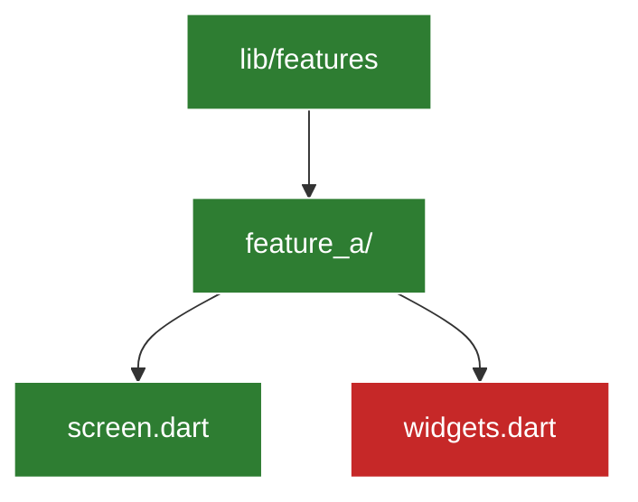

# Mermaid Diagrams Skill

## 1. Reglas de Ahorro de Tokens
- Usar identificadores cortos para nodos (`w1`, `w2`, `s1`, `mod1`).
- Evitar etiquetas extremadamente largas dentro de los corchetes.
- Agrupar subgráficos solo cuando la complejidad del módulo lo requiera.

## 2. Clases Estándar de Estado (Tracker)
Definir siempre las clases al inicio del diagrama de rastreo:

## 3. Actualización Incremental
- Al completar una tarea o refactorización, cambiar la clase del nodo individual de `:::pending` a `:::done`.
- El agente utilizará el primer nodo `:::pending` del diagrama como punto de reanudación en la siguiente sesión.
