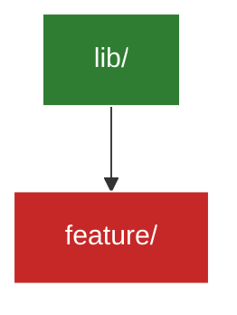

# Tracker: arquitectura y rutas

```mermaid
graph TD
    classDef done fill:#2e7d32,stroke:#fff,color:#fff;
    classDef pending fill:#c62828,stroke:#fff,color:#fff;

    root[lib/]:::done --> f1[feature/]:::pending
```

`done`: auditado. `pending`: pendiente de revisar.
