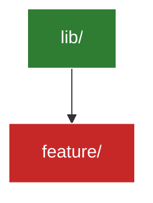

# Tracker: arquitectura y rutas

## Mapa de módulos

`done`: auditado. `active`: en trabajo actual. `pending`: pendiente de revisar.

---

## Componentes por capa

| ID | Capa | Componente / Archivo | Estado | Notas |
|---|---|---|---|---|
| a1 | Presentation | | activo | |
| a2 | Domain | | activo | |
| a3 | Data | | activo | |

Estados: `activo`, `refactor pendiente`, `deprecado`, `bloqueado`.

---

## Dependencias externas relevantes

| Paquete | Versión fijada | Propósito | Estado |
|---|---|---|---|
| | | | `ok` / `desactualizado` / `conflicto` |

---

## Deuda técnica

| ID | Descripción | Prioridad | Vinculado a work.md |
|---|---|---|---|
| d1 | | alta / media / baja | |

---

## Decisiones de arquitectura (ADR mínimo)

<!-- Registrar decisiones significativas para que Agentes entrantes entiendan el "por qué" sin reabrir discusiones resueltas. -->

### [YYYY-MM-DD] [Título de la decisión]

- **Contexto:** …
- **Decisión tomada:** …
- **Consecuencias / trade-offs:** …
- **Agente que decidió:** [firma — ver `core/communication.md §3`]
